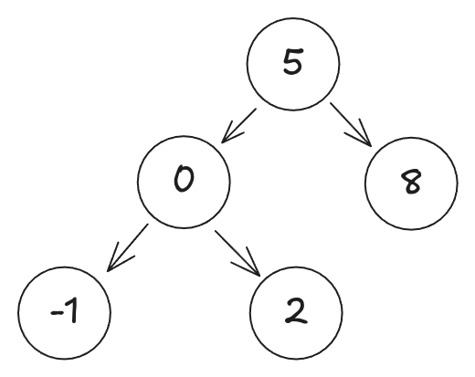
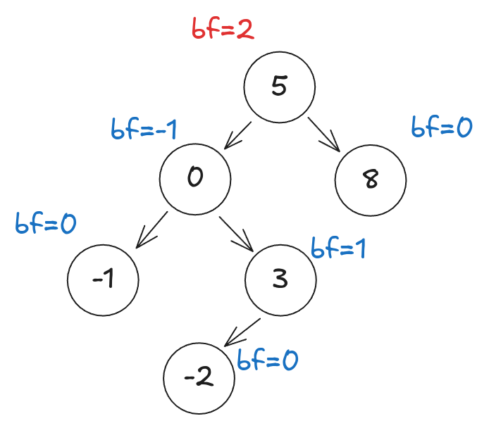
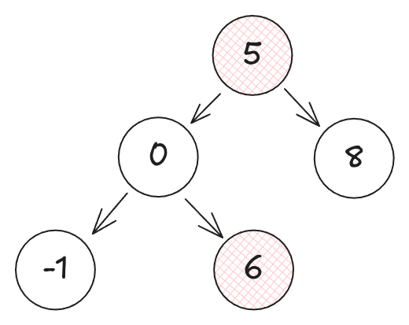

# Link Containers

In this assignment, you will implement a linked list and a balanced binary
search tree (AVL tree) to get experience with generic data structures and
ownership in Rust.

Notes:

1. Submissions should not have compilation warnings or errors.

2. Code you submit should be formatted with `rustfmt`, the standard Rust
   formatter. If you are using the recommended editor setup, using
   VSCode's built-in formatting functionality will take care of this. If you
   submit code with a significant amount of formatting issues, we may deduct
   points.

3. All functions can be implemented iteratively or recursively. You are free to
   choose the implementation that you think is best.

4. There are no performance requirements for this project. While linked lists
   and AVL trees are typically used when their performance characteristics are
   desired, the goal of this project is to give you experience with generic
   data structures in Rust, so the performance of your implementations is not a
   concern.

5. Beyond understanding the list and tree data structures, the main difficulty
   of this assignment is that you can't clone the data in the list or tree,
   since the interior type may not implement `Clone`. This means you'll need to
   be careful about how you handle ownership. If you are stuck, think carefully
   about which variables should be owned and which should be references.

6. The first half of the assignment (list) is less challenging than the second
   half (tree), but the points are distributed evenly between the two parts.
   Therefore, you should aim to complete all of part 1, and as much of part 2
   as you can.

## Part 1: Linked List

To start you'll implement a singly linked list that is generic over the stored type. The list is defined like so:

```rust
pub enum ListNode<T> {
    Nil,
    Cons(T, Box<ListNode<T>>),
}
```

All code for this part is in `src/list.rs`. You should not change the definition of `ListNode`.

You will implement a variety of methods and traits on `ListNode` to make it a
useful generic data structure that could be used in someone else's code. This
will involve writing new generic `impl` blocks for `ListNode<T>`.

### Trait implementations

To begin, you'll implement a few traits for `ListNode<T>`. Some of these traits
should only be implemented if `T` implements the trait as well. For guidance on
how to write `impl` blocks for generic types, see ["Using Trait Bounds to
Conditionally Implement Methods" in the
textbook](https://doc.rust-lang.org/book/ch10-02-traits.html#using-trait-bounds-to-conditionally-implement-methods).

To implement a trait, you must implement all the required methods with the
proper signatures. To see these methods, you can consult the documentation for
the trait you are implementing.

Since the tests won't compile without these traits implemented, all the tests
are commented out to begin with. As you implement the traits, you can uncomment
the tests in `tests/test_list.rs` and run `cargo test` to check your work.

- Implement `Default` for `ListNode<T>`. The default value should be `Nil`.
  - documentation: [`Default`](https://doc.rust-lang.org/std/default/trait.Default.html)
  - tests: `test_impls_default_3`
- If `T` implements `PartialEq`, implement `PartialEq` for `ListNode<T>`.
  - documentation: [`PartialEq`](https://doc.rust-lang.org/std/cmp/trait.PartialEq.html)
  - tests: `test_impls_partialeq_5`
- If `T` implements `Eq`, implement `Eq` for `ListNode<T>`.
  - documentation: [`Eq`](https://doc.rust-lang.org/std/cmp/trait.Eq.html)
  - tests: `test_impls_eq_3`
- If `T` implements `Display`, implement `Display` for `ListNode<T>`.
  - The elements of the list should be separated with `->` and end with `Nil`. For example, a list might be displayed as `1 -> 2 -> 3 -> Nil`.
  - For an example `Display` implementation, see the [`Display` trait documentation](https://doc.rust-lang.org/std/fmt/trait.Display.html#examples).
    Note that implementing `Display` simply consists of printing your type as desired, except calls to `println!(...)` are replaced with calls to `write!(f, ...)`.
  - tests: `test_impls_display_3`

### Method implementations

To implement the core functionality of your linked list, you should implement the following functions.

```rust
impl<T> ListNode<T> {
    pub fn new() -> Self;
    pub fn insert(&mut self, value: T) -> &mut Self;
    pub fn reverse(&mut self);
}
```

The skeleton for these methods is provided in the stencil code. You should not
change their signatures or the trait bounds of the `impl` block. You may
consult the internet for algorithmic guidance on how to reverse a linked list,
but searching for Rust code specifically is disallowed.

If you are having trouble with a specific test case, you can paste it into
`main.rs` and use `cargo run` instead. This can make it easier to use print debugging.

#### A note on `insert` and `reverse`

While implementing both of these methods, you will likely want to move values
out of the list and then move them back in. However, attempting to do this will
result in compiler errors, since both methods take `self` by mutable reference,
as opposed to by ownership. To work around this, you can use `std::mem::take`
from the standard library. This function takes a mutable reference to a value
and replaces it with a default value of the same type, returning the original
value. For example,

```rust
use std::mem;
impl<T> ListNode<T> {
  // Use the implementation of this method to guide your implementation of
  // `insert` and `reverse`
  /// Deletes a node from the list
  pub fn delete(&mut self) {
    // Temporarily replaces the current node with default value (Nil).
    // In exchange, we get to take ownership of the current node instead of just
    // having it by mutable reference.
    let as_owned: ListNode<T> = mem::take(self);
    match as_owned {
      ListNode::Nil => {}
      ListNode::Cons(_, next) => {
        // Write the next node to the current node
        *self = *next;
      }
    }
  }
}
```

This code follows the general pattern your `insert` and `reverse` methods could follow

1. Take ownership of the current node using `std::mem::take`.
2. Modify the node as needed.
3. Write the modified node back to the original location (`self`).

You may also find the function `mem::replace` useful. This function takes a
mutable reference to a value and replaces it with a new value, returning
ownership of the original value. It is just like `mem::take`, but it allows
using a custom value instead of a default value.

```rust
use std::mem;
impl ListNode<i32> {
  pub fn set_to_5(&mut self) {
    match self {
      ListNode::Nil => {}
      ListNode::Cons(value, _) => {
        let old_value = mem::replace(value, 5);
        println!("Old value was {:?}", old_value);
      }
    }
  }
}
```

After this section, all the following tests should be un-commented and passing
* test_impls_default_3
* test_impls_display_3
* test_impls_eq_3
* test_impls_partialeq_5
* test_insert_simple_3
* test_insert_7
* test_reverse_7


### More Trait implementations

Finally, you should implement the `From` trait in two ways to allow conversion back and forth between `Vec<T>` and `ListNode<T>`.

- Implement `From<Vec<T>>` for `ListNode<T>`.
  - `insert` from the previous section may be useful here.
  - documentation: [`From`](https://doc.rust-lang.org/std/convert/trait.From.html)
  - tests: `test_impls_list_from_vec_3`
- Implement `From<ListNode<T>>` for `Vec<T>`.
  - documentation: [`From`](https://doc.rust-lang.org/std/convert/trait.From.html)
  - tests: `test_impls_vec_from_list_3`, `test_insert_roundtrip_10`

This allows you to convert a `Vec` into a `ListNode` and vice versa. For example:

```rust
let vec = vec![1, 2, 3];
let list: ListNode<i32> = vec.into();
let back_to_vec: Vec<i32> = list.into();
```

If you are having trouble with the implementation, you can start by writing the
`impl` block and the method signature, while leaving the body as `todo!()`.
This will allows you to submit to the autograder (if the trait implementation
doesn't exist, your code will fail to compile).

Once you are done with this section, make sure all the tests in `test_list.rs`
are un-commented and run `cargo test` to check your implementation.

## Part 2: Balanced Binary Search Tree

You will now implement a balanced binary search tree (specifically, an [AVL
tree](https://en.wikipedia.org/wiki/AVL_tree)) that is generic over the stored
type. The tree is defined like so:

```rust
pub enum TreeNode<T: Ord> {
    Leaf,
    Node(T, Box<TreeNode<T>>, Box<TreeNode<T>>),
}
```

Note that the tree is generic over the type `T`, which must implement the trait
`Ord` (which is for types that have a total order), since keys need to be
comparable.

### Aside: an introduction to balanced binary search trees

A **binary tree** is a tree data structure in which each node has at most two children.

A **binary search tree** is a binary tree in which each node has a value, and

- the value of each node is greater than all values in its left subtree
- the value of each node is less than all values in its right subtree

A **balanced binary search tree** is a binary search tree in which the height of the left and right subtrees of every node differ by at most one. We call this difference the "balance factor."

An example balanced binary search tree:



An example unbalanced binary search tree (with balance factors annotated):



An example binary tree that does not satisfy the binary search tree property (note that 6 is in the left subtree of 5, but 6 is greater than 5):



Balanced binary search trees (BBSTs) are desirable because given a BBST with
`N` nodes, we can check if an element exists or insert one in `O(log N)` time.
This is because the height of a BBST is `O(log N)`.

To maintain the balance property on insertions, a variety of algorithms exist.
We will use the AVL tree algorithm. After an insertion, the following rebalance
algorithm is run on each node along the insertion path.

**Rebalance algorithm:**

Input: A node `n` in the tree.

```
def rebalance(n):
   bf <- the balance factor of `n`.
   if bf is -2:
      right <- the right child of `n`.
      right_bf <- the balance factor of `right`.
      if right_bf is 1:
        perform right rotation on right.
      perform left rotation on `n`.
  if bf is 2:
      left <- the left child of `n`.
      left_bf <- the balance factor of `left`.
      if left_bf is -1:
        perform left rotation on left.
      perform right rotation on `n`.
```

In practice, the balance factor would be cached on each node. For our purposes, recomputing each time is acceptable.

**Rotations:**
The rebalance algorithm uses two types of rotations: left and right. Rotations modify a binary search tree in constant time while maintaining the binary search tree property.

This example from Wikipedia provides examples of a left and right rotation. Circles represent tree nodes and triangles represent arbitrary subtrees.


**Left rotation algorithm:**

```
def rotate_left(n):
  right <- the right child of `n`.
  n.left = Node(node.value, n.left, right.left)
  n.value = right.value
  n.right = right.right
```

**Right rotation algorithm:**

```
def rotate_right(n):
  left <- the left child of `n`.
  n.right = Node(node.value, left.right, n.right)
  n.value = left.value
  n.left = left.left
```

### Trait Implementations

Start by implementing the following traits for `TreeNode`. As with part 1,
uncomment the relevant tests as you progress to check your progress.

- Implement `Default` for `TreeNode<T>`. The default value should be `Leaf`.
  - documentation: [`Default`](https://doc.rust-lang.org/std/default/trait.Default.html)
  - tests: `test_impls_default_5`
- Implement `PartialEq` for `TreeNode<T>`.
  - documentation: [`PartialEq`](https://doc.rust-lang.org/std/cmp/trait.PartialEq.html)
  - tests: `test_impls_eq_5`
- Implement `Eq` for `TreeNode<T>`.
  - documentation: [`Eq`](https://doc.rust-lang.org/std/cmp/trait.Eq.html)
  - tests: `test_impls_eq_5` (same as previous)

If you are struggling to get started, you can look at some of the provdied
methods like `is_bst` and `is_balanced` to get a sense of how to work with the
`TreeNode`.

### Method Implementations

To start, we will only implement a binary search tree, without rebalancing. This requires implementing the following functions:

```rust
impl<T: Ord> TreeNode<T> {
    pub fn node(value: T, left: TreeNode<T>, right: TreeNode<T>) -> TreeNode<T>;
    pub fn new() -> TreeNode<T>;
    pub fn insert(&mut self, value: T);
}
```

See the comments on the methods in the stencil code for more information on
what each method should do. You should not change their signatures or the trait
bounds of the `impl` block.

If you are having trouble with a specific test case, you can paste it into
`main.rs` and use `cargo run` instead. `Display` has been implemented for
`TreeNode<T>` for you, so printing the tree is a valid debugging strategy. To
see an example, uncomment the `tree_example()` in `main.rs`.

After this section, you should have un-commented and be passing the following tests
* `test_impls_eq_5`
* `test_impls_default_5`
* `test_insert_same_5`

### More Trait Implementations

Now, you should implement the `From` trait in two ways to allow conversion back and forth between `Vec<T>` and `TreeNode<T>`.

- Implement `From<Vec<T>>` for `TreeNode<T>`.
  - `insert` from the previous section may be useful here.
  - documentation: [`From`](https://doc.rust-lang.org/std/convert/trait.From.html)
  - tests: no tests
- Implement `From<TreeNode<T>>` for `Vec<T>`.
  - This should implement a [in-order traversal](https://www.geeksforgeeks.org/inorder-traversal-of-binary-tree/) of the tree.
    In other words, if the tree satisfies the binary search tree property, then the resulting vector will be sorted.
  - documentation: [`From`](https://doc.rust-lang.org/std/convert/trait.From.html)
  - tests: `test_insert_roundtrip_10`

This allows you to convert a `Vec` into a `TreeNode` and vice versa. For example:

```rust
let vec = vec![1, 2, 3];
let tree: TreeNode<i32> = vec.into();
let back_to_vec: Vec<i32> = tree.into();
```

If you are having trouble with the implementation, you can start by writing the
`impl` block and the method signature, while leaving the body as `todo!()`.
This will allows you to submit to the autograder (if the trait implementation
doesn't exist, your code will fail to compile).

Once you are done with this section, make sure all the tests in `test_tree.rs`
are un-commented and run `cargo test` to check your implementation. You should
be passing all tests **besides**
 
* `test_insert_5`.
* `test_rebalance_root_5`
* `test_rotate_left_5`
* `test_rotate_right_5`


### More Method Implementations

Finally, you will implement the rotation and balancing algorithms to turn your
binary search tree into a balanced binary search tree. You will implement the
following methods:

```rust
impl<T: Ord> TreeNode<T> {
    fn balance_factor(&self) -> i32;
    pub fn left_rotate(&mut self);
    pub fn right_rotate(&mut self);
    fn rebalance(&mut self);
}
```

As before, the definitions are provided in the stencil and the signatures
should not be changed. This is the most difficult part of the assignment, so
consider ownership carefully and come to hours or post on Ed if you are
confused.

Don't forget to add a call to `rebalance` in your `insert` function once your
implementation is complete.

After this section, all tests in `tests/test_tree.rs` should be un-commented
and passing.

#### A Note on Rotations

Much like with `reverse` and `insert`, you will likely need to move values out
of the tree to implement rotations. Once again, you can use `mem::take` to turn a
mutable reference into an owned value by replacing the value with a default (in
this case, `Leaf`). In addition, since `TreeNodes` are often wrapped in a box,
note that it's also valid to call take on a `&mut Box<TreeNode<T>>` to get a
`Box<TreeNode<T>>`.

As with `reverse` and `insert`, the rotation code will follow the pattern.

1. Take ownership of the current node using `mem::take`.
2. Modify the node as needed.
3. Write the modified node back to the original location (`self`).

Additionally, you may find `std::mem::replace` (explained more above) useful
for rotations.

## Finishing Up

Make sure your code is formatted and compiles without warnings or errors. Run
`cargo test` to check your implementation. Finally submit to the autograder and
confirm that it runs successfully.
